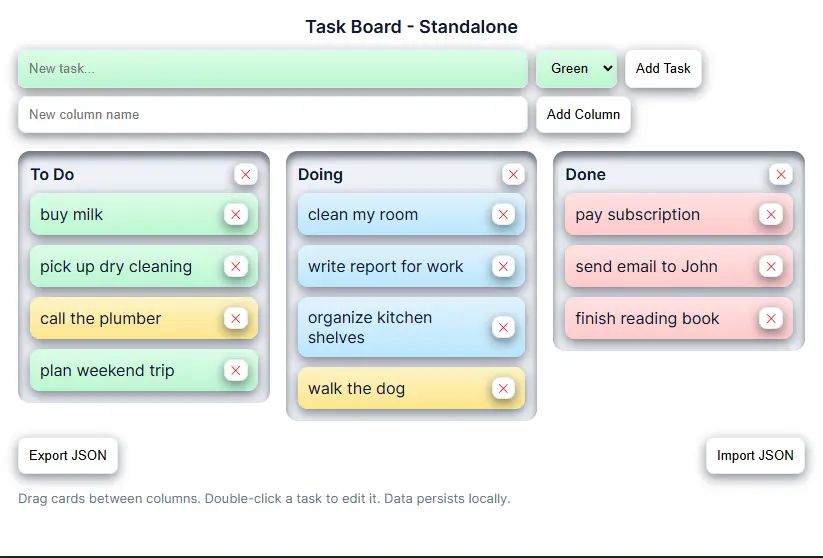

# Task Board – Standalone

A lightweight, standalone **Kanban-style task board** built with **vanilla HTML, CSS, and JavaScript**.  
No frameworks, no build tools, no backend - just open `index.html` in your browser and start organizing tasks.

Tasks and columns persist locally **only for you** using `localStorage`, and boards can be exported/imported as JSON for sharing. Click on the image below to see it in action and import `Demo-Tasks.json`:

## Features

- Kanban board with customizable columns
- Add, edit (double-click), and delete tasks
- Color-coded tasks (Green, Blue, Red, Yellow)
- Drag & drop tasks between columns
- Create and delete columns dynamically
- Persistent storage via `localStorage`
- Export board state to JSON
- Import board state from JSON
- Single-file, offline-friendly, zero dependencies
---
## How It Works

- **State Management:** All board data is stored in `localStorage` as a serialized object.
- **Persistence:** Tasks and columns reload automatically on page refresh.
- **Drag & Drop:** Uses the native HTML5 Drag & Drop API for a smooth, dependency-free experience.
## Usage Guide

### Task Management
- **Add a Task:** Enter text in the `New task…` input, choose a color, and click **Add Task**.
- **Edit a Task:** Double-click a task’s text to enter edit mode.
- **Move a Task:** Drag and drop it between columns.
- **Add a Column:** Enter a column name and click **Add Column**.

### Data Portability
- **Export JSON:** Download your board data for backup or sharing.
- **Import JSON:** Restore a board from a previously saved JSON file.

